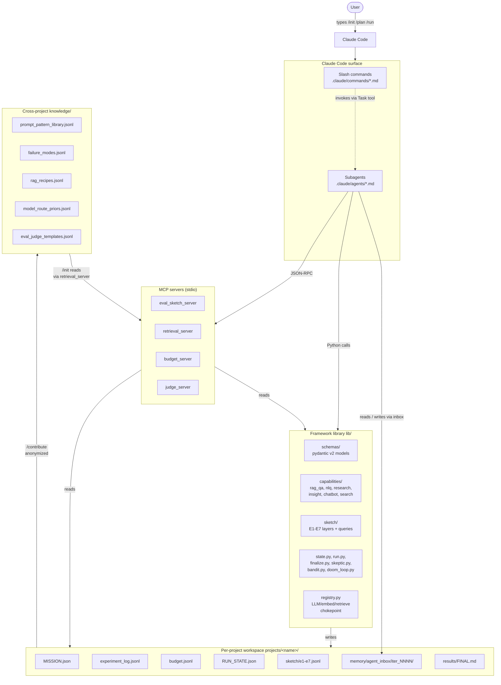
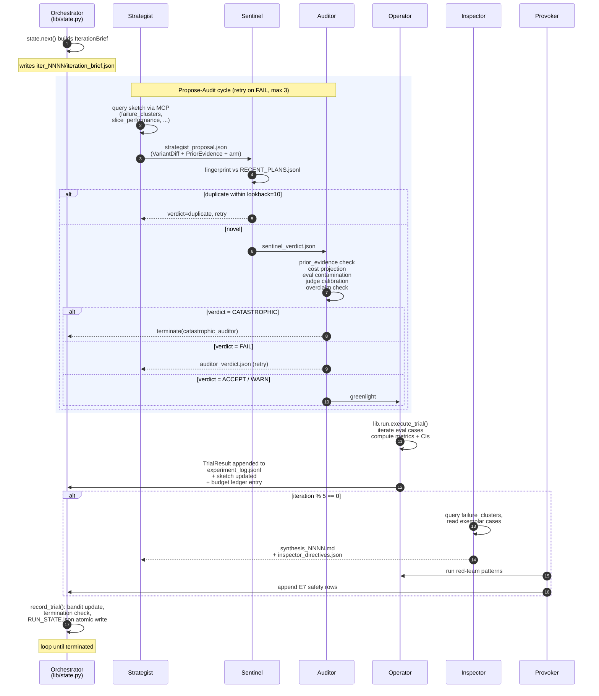
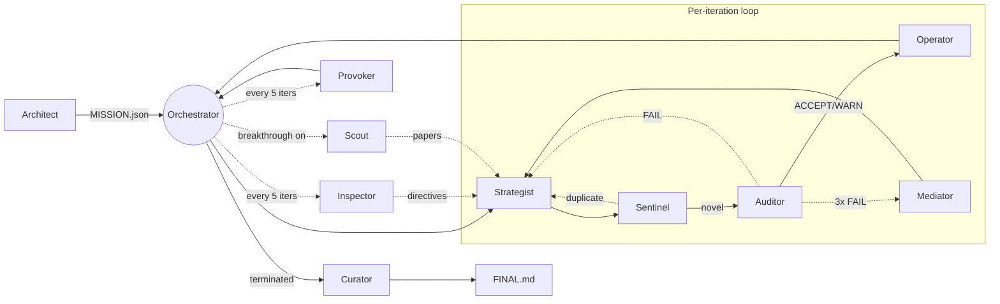
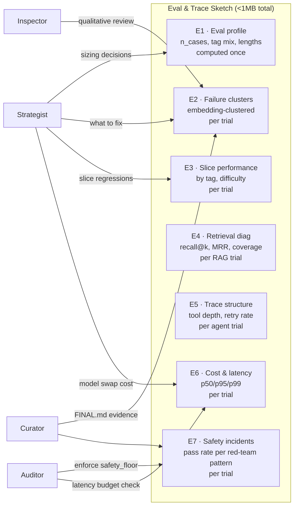
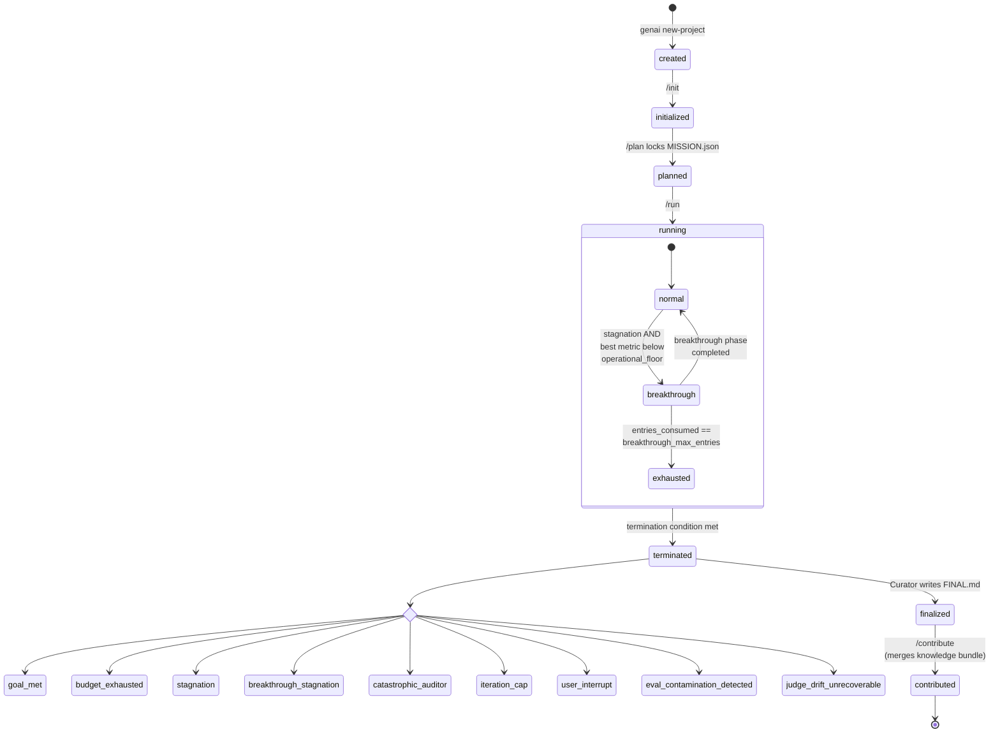
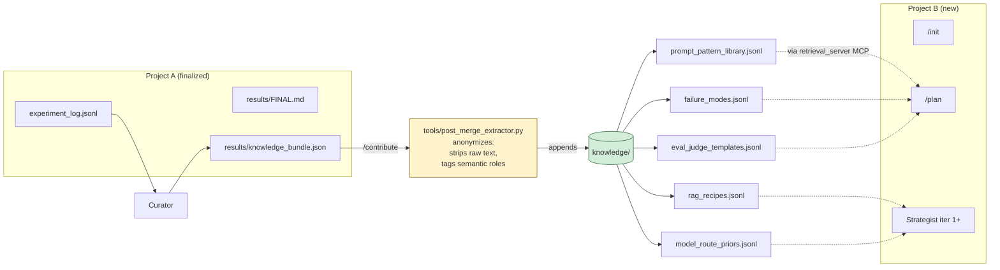
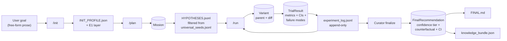

# evalsmith

> Deterministic, multi-agent framework for building GenAI applications — RAG, NLQ, research agents, insight agents, chatbots, and search/recommendation engines. Built on Claude Code; agents collaborate through schema-validated JSON files instead of free-form chat. Cross-project knowledge compounds across runs.

The substrate is GenAI evals + traces (eval cases, retrieval traces, judge reports, failure clusters), and the subagent roster is built around prompt/RAG/agent-design optimization loops rather than statistical modeling.

---

## Table of Contents

- [Why this exists](#why-this-exists)
- [System architecture](#system-architecture)
- [The iteration loop](#the-iteration-loop)
- [Subagent roster](#subagent-roster)
- [Capabilities supported](#capabilities-supported)
- [The Eval & Trace Sketch](#the-eval--trace-sketch)
- [State machine and termination](#state-machine-and-termination)
- [Cross-project knowledge flow](#cross-project-knowledge-flow)
- [Data lifecycle](#data-lifecycle)
- [Quick start](#quick-start)
- [Slash commands (Claude Code surface)](#slash-commands-claude-code-surface)
- [CLI (outside Claude Code)](#cli-outside-claude-code)
- [Repository layout](#repository-layout)
- [Configuration](#configuration)
- [Determinism & replay](#determinism--replay)
- [Tests](#tests)
- [FAQ / troubleshooting](#faq--troubleshooting)

---

## Why this exists

Most GenAI app development is ad-hoc prompt-tweak-and-vibe-check. evalsmith treats it as a **disciplined optimization loop**:

- **Schemas are truth.** Every artifact (Mission, Variant, TrialResult, JudgeReport) is a pydantic-validated JSON file. Subagents pass paths, not free-text payloads.
- **Agents never read raw eval data.** They query a compact **Eval & Trace Sketch** (7 layers, <1MB) — failure clusters, slice performance, retrieval diagnostics, cost/latency, safety incidents.
- **Determinism is sacred.** Same inputs → same trial id → same metrics. Every run is `genai replay`-able.
- **Honest failure is shippable.** `no_signal — collect more data` is a valid `FINAL.md` outcome with full evidence trail.
- **Knowledge compounds.** Finalized projects anonymize their findings into a shared `knowledge/` library that every future project automatically retrieves.
- **Specialization beats megaprompts.** Ten specialist subagents debate through JSON files; no single mega-Claude doing everything.

---

## System architecture

How the user, Claude Code, subagents, the framework library, MCP servers, and on-disk artifacts fit together. Arrows are read/write directions.



**Key invariants:**
- Subagents never reach into the library directly — they call MCP tools (for sketch / retrieval / budget / judge data) or write JSON to the inbox.
- The library never imports from `.claude/` or `mcp_servers/`. Dependency arrow always points inward.
- Project artifacts are append-only logs (no edits, only new rows). The on-disk state IS the source of truth — in-memory orchestrator state is a cache.

---

## The iteration loop

What happens during `/run`. Strategist → Sentinel → Auditor → Operator is the hot path; Inspector + Provoker fire every 5 iterations; Scout fires only on breakthrough entry.



---

## Subagent roster

Ten specialist subagents. Each has a single `.claude/agents/<name>.md` spec with frontmatter declaring the model tier. Names deliberately differ from the source inspiration so the roles are read fresh.

| Subagent       | Tier   | Runs when                                    | Reads                                                                  | Writes                                       |
|----------------|--------|----------------------------------------------|------------------------------------------------------------------------|----------------------------------------------|
| **Architect**  | Sonnet | `/plan` only                                 | `INIT_PROFILE.json` + user Q&A                                          | `MISSION.json`, seeded `HYPOTHESES.jsonl`    |
| **Strategist** | Haiku  | Every iter                                   | `iteration_brief.json` + targeted sketch queries + knowledge snippets   | `strategist_proposal.json` (VariantDiff)     |
| **Scout**      | Sonnet | Breakthrough entry only                      | Mission, top failure clusters, web                                      | `scout_papers.jsonl` (≤5 papers w/ URLs)     |
| **Sentinel**   | Haiku  | Every proposal                               | `strategist_proposal.json` + `RECENT_PLANS.jsonl`                       | `sentinel_verdict.json` (novel/duplicate)    |
| **Auditor**    | Haiku  | Every novel proposal                         | proposal + Mission + eval set + JudgeCalibration                        | `auditor_verdict.json` (ACCEPT/WARN/FAIL/CATASTROPHIC) |
| **Mediator**   | Sonnet | 3rd consecutive FAIL on same iter            | All 3 proposal/verdict pairs                                            | `mediator_directive.json` (binding constraints) |
| **Operator**   | Haiku  | After ACCEPT/WARN verdict                    | Proposal + parent Variant + eval set                                    | `experiment_log.jsonl` row, sketch updates   |
| **Inspector**  | Sonnet | Every 5 iters + at termination               | failure_clusters + up to 3 exemplars per cluster + last 5 trials        | `synthesis_NNNN.md` + `inspector_directives.json` |
| **Curator**    | Sonnet | On termination                               | Full log + Inspector synthesis + JudgeCalibration + Mission              | `FINAL.md`, `knowledge_bundle.json`          |
| **Provoker**   | Haiku  | `/init`, every 5 iters, at termination       | Red-team pattern library + current best Variant                         | E7 sketch rows                               |

### Handoff diagram



---

## Capabilities supported

Six capability modules. Each declares which technique families are valid bandit arms and which metrics make sense.

| Capability       | Task                                          | Primary metrics                        | Allowed bandit arms                                                                         |
|------------------|-----------------------------------------------|----------------------------------------|---------------------------------------------------------------------------------------------|
| `rag_qa`         | Retrieval-augmented QA over a corpus          | judge_score, recall_at_5               | prompt_rewrite, few_shot_selection, model_swap, retriever_change, chunking_change, rerank_add_or_change, guardrail_add |
| `nlq_to_query`   | NL → SQL/GraphQL/API/DSL                      | exact_match_normalized, execution_equivalence | prompt_rewrite, few_shot_selection, model_swap, tool_schema_edit, decoding_params       |
| `research_agent` | Multi-step research with citations            | citation_quality, faithfulness, coverage | prompt_rewrite, model_swap, tool_schema_edit, decoding_params, guardrail_add               |
| `insight_agent`  | Structured extraction from documents          | insight_precision, insight_recall, schema_validity | prompt_rewrite, tool_schema_edit, model_swap, chunking_change, guardrail_add, decoding_params |
| `search_engine`  | Ranking with LLM rerank                       | ndcg_at_10, map_at_10                  | retriever_change, rerank_add_or_change, prompt_rewrite, model_swap, router_policy           |
| `chatbot`        | Multi-turn conversation                       | judge_score, task_success_rate         | prompt_rewrite, few_shot_selection, model_swap, router_policy, guardrail_add, decoding_params |

---

## The Eval & Trace Sketch

The substrate that lets subagents reason about results without ever loading raw eval cases. Seven append-only layers under `<project>/sketch/`.



The layers are pure JSON-Lines files; the MCP server exposes thin query functions over them. Subagents always go through queries — never read the raw files. This is what keeps the agent context lean and the determinism guarantees holding.

---

## State machine and termination

The orchestrator's RunState is the atomic resume cursor. `/resume` reads it; `/run` advances it. Breakthrough is a sub-state activated on stagnation below the operational floor.



**Termination priority** (first match wins, applied in `lib/state.py:_termination_check`):
1. `budget_exhausted` — budget ledger > Mission ceiling
2. `iteration_cap` — current_iteration ≥ Mission.max_iterations
3. `goal_met` — primary metric hits target
4. `breakthrough_stagnation` — breakthrough phase didn't pay off AND entries exhausted
5. `stagnation` — N iters w/o improvement AND breakthrough exhausted
6. `catastrophic_auditor` — eval contamination, unrecoverable judge drift, etc.

---

## Cross-project knowledge flow

Why every project on the *same* framework install gets stronger over time.



**Anonymization rules** (enforced by `tools/post_merge_extractor.py`):
- Strip raw eval inputs/outputs entirely.
- Replace product/company/person names with semantic-role tags (`<role:product_name>`, `<role:user_question>`).
- Fail the merge if any record contains markers like `@`, file paths, or strings >600 chars (heuristic for un-scrubbed eval text).

---

## Data lifecycle

What flows from user goal to final recommendation, in terms of pydantic schemas.



The arrow from LOG back to RUN is the loop — every iteration reads the prior log to compute IterationBrief.

---

## Quick start

> **Hands-on guides:**
> - **[docs/WALKTHROUGH.md](docs/WALKTHROUGH.md)** — step-by-step from `pip install` to reading `FINAL.md`.
> - **[docs/PDF_RAG_GUIDE.md](docs/PDF_RAG_GUIDE.md)** — how to point evalsmith at a folder of PDFs and tune a RAG pipeline over them.
> - **[docs/DATABASES_AND_CHAT.md](docs/DATABASES_AND_CHAT.md)** — connect SQLite/PostgreSQL/MySQL/Oracle/MSSQL for NLQ with execution-equivalence eval, plus the `genai chat` interactive REPL.

### Prerequisites

- Python 3.9+ (works on 3.10/3.11/3.12 too)
- Git
- (Optional) Anthropic API key for real LLM calls; without it the framework runs in deterministic-stub mode (good for testing and replay)

### Install

```bash
git clone https://github.com/AkshayDat/evalsmith-.git
cd evalsmith-
pip install -e .
# Optional extras:
pip install -e ".[llm,rag,test]"
```

### Create your first project

```bash
genai new-project my_first --recipe rag_qa
# Project workspace created at projects/my_first/

# Drop your eval cases as JSON Lines into:
#   projects/my_first/data/eval_set.jsonl
# (See projects/.templates/_project_template/data/eval_set.example.jsonl for the shape.)
```

### Run the pipeline (in Claude Code)

```
/init my_first      # profile the eval set, baseline trial
/plan my_first      # Architect Q&A, lock MISSION.json
/run my_first       # autonomous loop until terminated
/status my_first    # any time, read-only snapshot
/contribute my_first  # after finalize, stage knowledge merge
```

### Outside Claude Code

Some operations are CLI-only because they don't need agent reasoning:

```bash
genai list                  # all projects + status
genai status my_first       # one-screen summary
genai library prompt_patterns --tag rag_qa
genai replay my_first       # verify determinism
```

---

## Slash commands (Claude Code surface)

| Command         | Phase           | What it does                                                                |
|-----------------|-----------------|----------------------------------------------------------------------------|
| `/init <p>`     | Inspection      | Profile eval set, run baseline trial, write `INIT_PROFILE.json`.            |
| `/plan <p>`     | Specification   | Architect Q&A → locked `MISSION.json` + seeded hypotheses.                  |
| `/run <p>`      | Optimization    | Autonomous loop: Strategist → Sentinel → Auditor → Operator → ... → Curator.|
| `/resume <p>`   | Recovery        | Resume from `RUN_STATE.json`. Refuses if finalized.                         |
| `/status <p>`   | Observation     | Read-only single-screen status (safe during `/run`).                        |
| `/contribute <p>` | Knowledge stage | Validate anonymization, append to `knowledge/`, stage merge PR.            |

Specs live under [`.claude/commands/`](.claude/commands).

---

## CLI (outside Claude Code)

```
genai new-project <name> [--recipe <r>] [--fork <other>]
genai list
genai status <name>
genai library <section> [--tag <t>]
   sections: prompt_patterns | failure_modes | rag_recipes | model_routes | judge_templates | all
genai chat <name> [--trial <id>] [--no-transcript]
genai replay <name>
```

**Companion ingestion tools** (called outside the CLI app):

```
python tools/ingest_pdfs.py --project projects/<name>           # PDFs  -> data/corpus.jsonl
python tools/introspect_db.py --project projects/<name>         # DB schema -> data/schema.txt
```

---

## Repository layout

```
evalsmith-/
├── README.md                       (you are here)
├── pyproject.toml                  package + genai console script
├── requirements.txt                core runtime deps
│
├── lib/                            framework implementation
│   ├── schemas/                    pydantic v2 models (Mission, Variant, Trial, Judge, …)
│   ├── capabilities/               6 capabilities (rag_qa, nlq, research_agent, …)
│   ├── domains/                    5 domain prior bundles (general, support_bot, …)
│   ├── sketch/                     E1–E7 layer builders + query surface
│   ├── state.py                    Orchestrator state machine + breakthrough
│   ├── run.py                      Trial executor
│   ├── eval.py                     Metric registry + bootstrap CI
│   ├── judges.py                   LLM-judge + calibration
│   ├── skeptic.py                  Auditor's deterministic checks
│   ├── bandit.py                   Thompson sampling over technique families
│   ├── doom_loop.py                Fingerprint-based novelty check
│   ├── retrieval.py                Cross-project knowledge load
│   ├── redteam.py                  Provoker patterns + scoring
│   ├── finalize.py                 Curator's FINAL.md assembly
│   ├── budget.py                   Append-only budget ledger
│   ├── agent_inbox.py              Per-iter JSON channel between subagents
│   ├── registry.py                 Single chokepoint for LLM/embed/retrieve
│   ├── variants.py                 Diff applier + normalized fingerprint
│   ├── corpus.py                   Corpus loader + BM25/dense/hybrid retrievers (RAG)
│   ├── db.py                       SQLAlchemy DB connector + safe SQL exec (NLQ)
│   ├── chat.py                     Interactive REPL loaded from winning Variant
│   └── cli.py                      `genai` CLI
│
├── .claude/
│   ├── commands/                   /init, /plan, /run, /resume, /status, /contribute
│   ├── agents/                     10 subagent specs
│   └── settings.example.json       MCP server wiring example
│
├── mcp_servers/                    stdio JSON-RPC MCP servers
│   ├── eval_sketch_server.py
│   ├── retrieval_server.py
│   ├── budget_server.py
│   └── judge_server.py
│
├── seeds/
│   └── universal_seeds.jsonl       8 universal seed hypotheses
│
├── recipes/                        pre-validated Mission templates
│   ├── rag_qa.json
│   ├── nlq_sql.json
│   ├── research_citation.json
│   ├── chatbot_support.json
│   ├── insight_extraction.json
│   └── search_engine.json
│
├── knowledge/                      cross-project library (grows on /contribute)
│   ├── prompt_pattern_library.jsonl
│   ├── failure_modes.jsonl
│   ├── rag_recipes.jsonl
│   ├── model_route_priors.jsonl
│   └── eval_judge_templates.jsonl
│
├── projects/
│   └── .templates/_project_template/   skeleton copied by `genai new-project`
│
├── tools/                          framework-level utilities
│   ├── post_merge_extractor.py     anonymization gate
│   ├── replay_runner.py            determinism verifier
│   ├── ingest_pdfs.py              PDF -> data/corpus.jsonl (lazy-loads pypdf)
│   ├── introspect_db.py            DB schema dump -> data/schema.txt
│   └── audit_repo.py               CI sanity check
│
├── docs/                           hands-on guides (linked from Quick start)
│   ├── WALKTHROUGH.md              step-by-step pipeline tour
│   ├── PDF_RAG_GUIDE.md            ingest PDFs and tune RAG over them
│   └── DATABASES_AND_CHAT.md       connect SQL/Oracle DBs for NLQ + chat REPL
│
└── tests/                          42 tests covering schemas, bandit, auditor,
                                    corpus, DB safety + execution, end-to-end
```

---

## Configuration

### Claude Code MCP servers

Copy `.claude/settings.example.json` → `.claude/settings.json` (or `settings.local.json` if you want personal config not committed):

```json
{
  "mcpServers": {
    "eval_sketch": {
      "command": "python",
      "args": ["mcp_servers/eval_sketch_server.py"],
      "env": {"GENAI_PROJECT_DIR": "projects/my_first"}
    },
    "retrieval": { "command": "python", "args": ["mcp_servers/retrieval_server.py"],
                   "env": {"GENAI_PROJECT_DIR": "projects/my_first"} },
    "budget":    { "command": "python", "args": ["mcp_servers/budget_server.py"],
                   "env": {"GENAI_PROJECT_DIR": "projects/my_first"} },
    "judge":     { "command": "python", "args": ["mcp_servers/judge_server.py"],
                   "env": {"GENAI_PROJECT_DIR": "projects/my_first"} }
  }
}
```

The `GENAI_PROJECT_DIR` env var tells each MCP server which project workspace to read. Update it when you switch active projects (or run multiple Claude Code instances, one per project).

### Environment variables

| Variable                   | Purpose                                                                 |
|----------------------------|-------------------------------------------------------------------------|
| `ANTHROPIC_API_KEY`        | Activates the Anthropic backend in `lib/registry.py`.                   |
| `OPENAI_API_KEY`           | Activates the OpenAI backend (fallback / alternative).                  |
| `GENAI_PROJECT_DIR`        | Tells MCP servers which project workspace to operate on.                |
| `GENAI_KNOWLEDGE_ROOT`     | Override the cross-project knowledge dir (for tests / multi-tenant).    |

If neither API key is set, the registry falls through to **deterministic stub mode** — outputs are reproducible content-hashes. Useful for testing, audit, and `genai replay`.

---

## Determinism & replay

Every artifact id is a content hash:

- `Mission.mission_id`     = hash(project_name, composition, eval_set_hash, goal_prose)
- `EvalSet.content_hash()` = hash of sorted case contents
- `Variant.variant_id`     = hash(prompt, retrieval, generation)
- `Trial.trial_id`         = hash(variant_id, eval_set_hash, seed)

If the eval set changes silently, the Auditor refuses. If a variant duplicates a recent fingerprint (paraphrased prompt etc.), the Sentinel rejects. The `genai replay` verb re-executes every trial in the log and diffs against the recorded metrics — drift > 10% on a deterministic metric flags a framework-version regression.

---

## Tests

```bash
python -m pytest tests/ -v
```

42 tests covering:
- **Schemas** — deterministic IDs, content-hash stability, mission validation
- **Bandit** — posterior persistence + Thompson sampling determinism with seed
- **Doom-loop** — fingerprint paraphrase detection
- **Auditor** — clean / missing evidence / empty diff / **eval contamination → CATASTROPHIC**
- **Corpus** — BM25 ranking + stemming, paragraph-aware chunking, stub fallback, registry routing
- **DB** — SELECT-only guard, comment-leading SQL, DoS-construct blocks, schema introspection, max_rows cap, result-set comparison (full / partial / failed)
- **End-to-end** — full pipeline against the stub backend (no API key needed)

Plus a framework-level audit:

```bash
python tools/audit_repo.py
```

Checks that every capability's declared metrics exist in the registry, every subagent's frontmatter is complete, every recipe parses, and every knowledge file is valid JSON-Lines.

---

## FAQ / troubleshooting

**Q. The framework starts trials but every one returns a stub answer.**
A. No API key is set. `lib/registry.py` falls back to a deterministic stub. Set `ANTHROPIC_API_KEY` to activate real calls.

**Q. `/plan` refuses, says "eval set too small".**
A. The Architect requires ≥20 cases. Grow `data/eval_set.jsonl` and retry.

**Q. The Auditor keeps issuing FAIL on `prior_evidence`.**
A. The Strategist must cite *something* — a sketch query, prior trial, seed, knowledge entry, or domain prior URL. Empty references are rejected by design.

**Q. The Sentinel calls every new variant a duplicate.**
A. Your Strategist is probably paraphrasing without structurally changing anything. Check if it's stuck on a single technique family — the bandit posteriors should diversify it. If not, the Mediator will eventually fire.

**Q. The judge agreement on calibration is <0.85.**
A. Every `judge_score` win will be downgraded to medium/low confidence in `FINAL.md`. Recalibrate by labeling more gold cases, or swap to a stronger judge model.

**Q. I want to use this with OpenAI / Azure / vLLM.**
A. The single chokepoint is `lib/registry.py`. Add a `_backend()` branch and implement the four call shapes (`_*_call`, `_*_chat`, …). Nothing else in the framework needs to change.

**Q. Can I plug in my own capability?**
A. Yes — subclass `CapabilityBase`, decorate with `@register_capability("name")`, declare `primary_metrics` + `allowed_arms`, and implement `run_single_case`. Make sure every metric in `primary_metrics` exists in `lib/eval.py` or add it.

**Q. How do I use this with my own PDFs?**
A. See [docs/PDF_RAG_GUIDE.md](docs/PDF_RAG_GUIDE.md). Short version: `pip install pypdf`, drop PDFs in `<project>/data/raw_pdfs/`, run `python tools/ingest_pdfs.py --project projects/<name>`, write an eval set citing the resulting `doc_id`s, then `/init` / `/plan` / `/run` as normal.

**Q. How do I connect a real database for NLQ?**
A. See [docs/DATABASES_AND_CHAT.md](docs/DATABASES_AND_CHAT.md). Short version: `pip install 'sqlalchemy>=2.0'` + your DB driver, drop credentials into `<project>/data/db.json`, run `python tools/introspect_db.py --project projects/<name>` to dump the schema, pick `eval_strategy=execution_equivalence` in `/plan`. Works with SQLite, PostgreSQL, MySQL, Oracle, MSSQL. Read-only guard + SELECT-only + statement timeout enforced by `lib/db.py` regardless of what the LLM generates.

**Q. How do I chat with the winning variant after optimization?**
A. `genai chat <project_name>` opens an interactive REPL. Multi-turn for chatbot missions, retrieve-then-generate for RAG, generate-SQL-then-execute for NLQ. Transcripts auto-save to `<project>/results/chat_log_*.jsonl` — useful as eval-set growth fodder when you spot a wrong answer.

**Q. I see a `data/db.json` warning about credentials. Is anything stored centrally?**
A. No. `db.json` is per-project and gitignored by the project template. The framework never reads/writes credentials to MISSION.json or knowledge/. Use a read-only DB role even with the framework's safety guard for defense-in-depth.

---

## License

Add your preferred license here (MIT/Apache 2.0/BSL/etc.). The repo currently ships without one.
